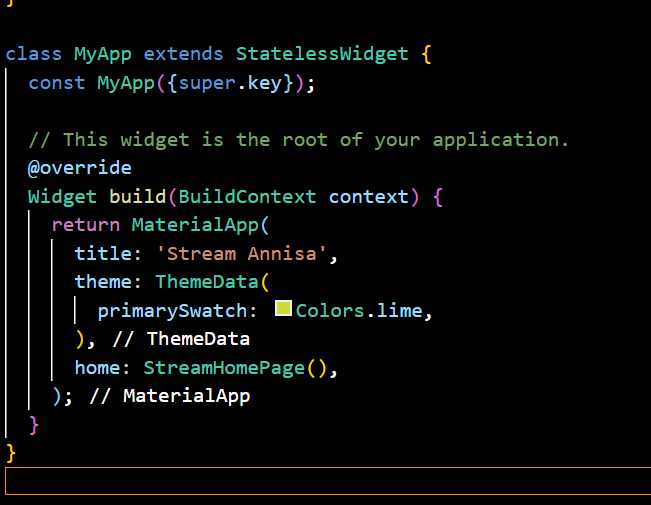
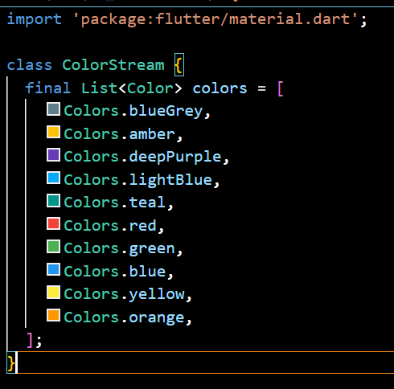
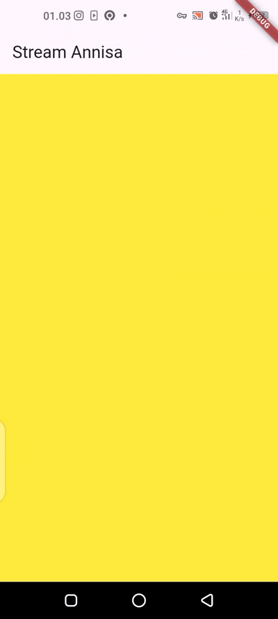
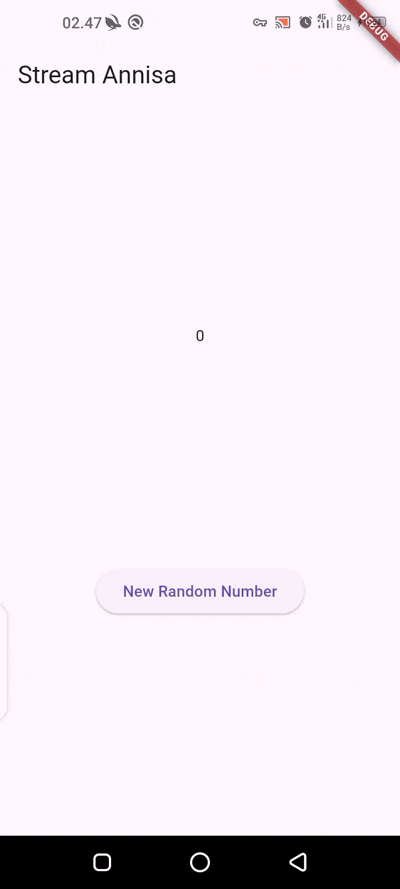
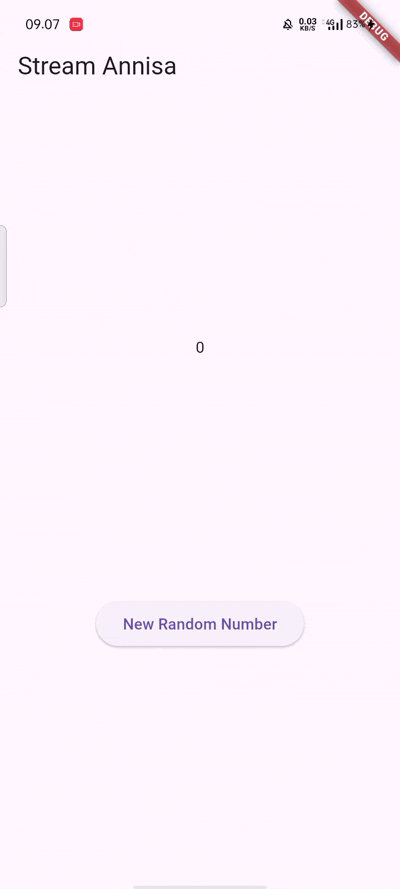
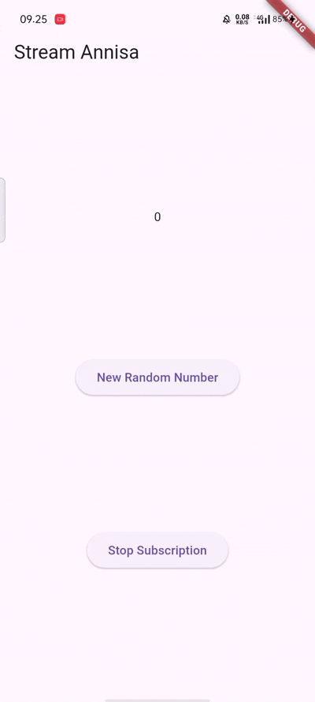
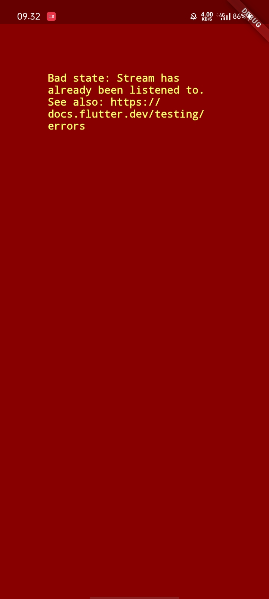
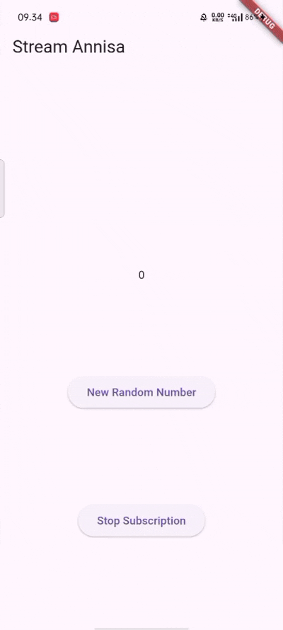
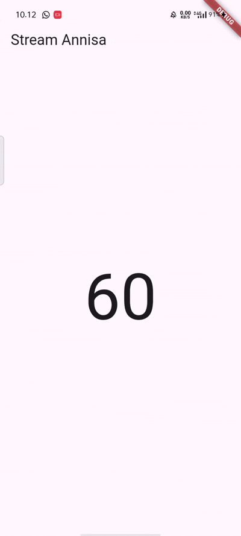

Praktikum 1

Soal 1

-> Tambahkan nama panggilan Anda pada title app sebagai identitas hasil pekerjaan Anda.

-> Gantilah warna tema aplikasi sesuai kesukaan Anda.

-> Lakukan commit hasil jawaban Soal 1 dengan pesan "P1: Jawaban Soal 1"

Soal 2

-> Tambahkan 5 warna lainnya sesuai keinginan Anda pada variabel colors tersebut.

-> Lakukan commit hasil jawaban Soal 2 dengan pesan "P1: Jawaban Soal 2"

Soal 3

-> Jelaskan fungsi keyword yield* pada kode tersebut!

Jawaban :

Keyword yield* digunakan untuk meneruskan (forward) hasil dari stream lain ke dalam stream ini. Dalam kode tersebut, yield* menyalurkan data dari Stream.periodic secara langsung sebagai bagian dari stream yang dihasilkan oleh getColors().

-> Apa maksud isi perintah kode tersebut?

Jawaban :

Kode tersebut menghasilkan stream warna yang berubah setiap 1 detik. Dengan Stream.periodic, setiap detik akan dihasilkan satu warna dari daftar colors, dimulai dari indeks 0 dan mengulang terus (dengan t % colors.length) agar warnanya bergantian secara siklus.

-> Lakukan commit hasil jawaban Soal 3 dengan pesan "P1: Jawaban Soal 3"

Soal 4

-> Capture hasil praktikum Anda berupa GIF dan lampirkan di README.

-> Lakukan commit hasil jawaban Soal 4 dengan pesan "P1: Jawaban Soal 4"

Soal 5

-> Jelaskan perbedaan menggunakan listen dan await for (langkah 9) !

Jawaban :
Perbedaan listen dan await for adalah pada cara mereka menangani stream. listen digunakan untuk mendaftarkan callback yang akan dijalankan setiap kali stream mengeluarkan data, dan tidak perlu berada di dalam fungsi async secara langsung. Sedangkan await for digunakan untuk mengiterasi stream secara asynchronous, jadi harus berada di dalam fungsi async, dan akan menunggu setiap data stream secara berurutan. Keduanya bisa digunakan untuk stream, tapi await for lebih cocok jika kita ingin menunggu dan memproses data satu per satu secara sinkron.

-> Lakukan commit hasil jawaban Soal 5 dengan pesan "P1: Jawaban Soal 5"

Soal 6

-> Jelaskan maksud kode langkah 8 dan 10 tersebut!

Jawaban :

Pada langkah 8, kode menampilkan angka terakhir (lastNumber) di layar dan menyediakan tombol "New Random Number". Ketika tombol ditekan, fungsi addRandomNumber() di langkah 10 akan dipanggil. Fungsi ini membuat angka acak antara 0–9, lalu mengirimkannya ke stream melalui numberStream.addNumberToSink(myNum). Dengan ini, UI bisa diperbarui setiap kali angka baru ditambahkan ke stream.

-> Capture hasil praktikum Anda berupa GIF dan lampirkan di README.

-> Lalu lakukan commit dengan pesan "P2: Jawaban Soal 6".

Soal 7

-> Jelaskan maksud kode langkah 13 sampai 15 tersebut!

jawaban :

Pada langkah 13, fungsi adderror() digunakan untuk memasukkan error ke dalam stream dengan controller.sink.addError('error'). Di langkah 14, stream akan mendengarkan data masuk; jika data valid, nilai lastNumber diperbarui sesuai event, namun jika terjadi error, maka lastNumber diubah menjadi -1 sebagai penanda error. Di langkah 15, pemanggilan adderror() digunakan untuk menguji alur penanganan error tersebut.

-> Kembalikan kode seperti semula pada Langkah 15, comment addError() agar Anda dapat melanjutkan ke praktikum 3 berikutnya.

-> Lalu lakukan commit dengan pesan "P2: Jawaban Soal 7"

Soal 8

-> Jelaskan maksud kode langkah 1-3 tersebut!

Jawaban :
Langkah 1–3 menggunakan StreamTransformer untuk memodifikasi aliran data sebelum diterima oleh listener. Di langkah 1, dibuat variabel transformer. Pada langkah 2, transformer dikonfigurasi agar setiap data int yang masuk dikalikan 10 (handleData), error akan diganti dengan nilai -1 (handleError), dan stream akan ditutup jika selesai (handleDone). Di langkah 3, stream dihubungkan ke transformer, lalu hasilnya dipantau dengan listen() agar nilai yang telah diubah bisa ditampilkan pada UI. Ini memungkinkan kontrol lebih besar terhadap data dan error yang mengalir ke dalam aplikasi.

-> Capture hasil praktikum Anda berupa GIF dan lampirkan di README.

-> Lalu lakukan commit dengan pesan "P3: Jawaban Soal 8".

Soal 9

-> Jelaskan maksud kode langkah 2, 6 dan 8 tersebut!

Jawaban :
Langkah 2 adalah Membuat stream angka, mendengarkan datanya, dan menyimpan angka terakhir yang dikirim, untuk diupdate di UI. lalu di langkah 6 ada subscription.cancel(); dimana disaat widget dihapus dari layar (dispose), langganan (subscription) ke stream dihentikan. terakhir di langkah 8 adalah code yang dibuat untuk menambahkan angka random ke stream, atau menunjukkan error (-1) kalau stream sudah tidak aktif.

-> Capture hasil praktikum Anda berupa GIF dan lampirkan di README.

-> Lalu lakukan commit dengan pesan "P4: Jawaban Soal 9"

Soal 10

Jelaskan mengapa error itu bisa terjadi ?

Jawaban :
Itu karena stream yang didengarkan (listen), didengarkan dua kali. Tapi stream normal tidak boleh di-listen lebih dari sekali, kecuali kalau dia di broadcast.

Soal 11

->Jelaskan mengapa hal itu bisa terjadi ?

Jawaban :
Ada dua subscription ke satu stream (subscription dan subscription2) yang sama-sama update UI.
Akibatnya, setiap kali menambahkan angka baru, hasilnya tampil dua kali.

->Capture hasil praktikum Anda berupa GIF dan lampirkan di README.

Lalu lakukan commit dengan pesan "P5: Jawaban Soal 10,11"

Soal 12

->Jelaskan maksud kode pada langkah 3 dan 7 !

Jawaban :
di langkah 3 membuat class NumberStream yang menghasilkan stream angka random setiap 1 detik menggunakan Stream.periodic. Sementara di langkah 7 menggunakan StreamBuilder untuk mendengarkan stream (numberStream) dan menampilkan angka terbaru secara otomatis di layar.
Kalau ada data, angka ditampilkan besar di tengah layar.

->Capture hasil praktikum Anda berupa GIF dan lampirkan di README.

Lalu lakukan commit dengan pesan "P5: Jawaban Soal 12"